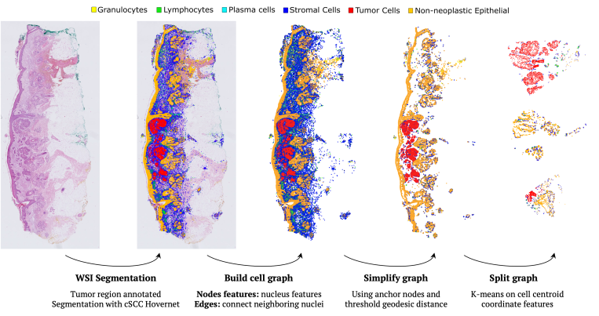

# Skin Cancer Epithelial Cell Classification with Scalable Graph Transformers

<div align="center">

[Project presentation](#todo) • [Project structure](#project-structure) • [Installation](#installation) •  [Datasets](#datasets) • [Node classification](#node-classification) • [Ablation study](#ablation-study) • [Generate your own cell graphs](#generate-your-own-cell-graphs) • [Visualize cell graphs](#visualize-cell-graphs)  • [Image Baseline](#image-baseline)  • [Citation](#citation)

</div>

<br>

This repository contains the code for ["Context-aware Skin Cancer Epithelial Cell Classification with Scalable Graph Transformers"](https://arxiv.org/abs/2602.15783)  paper.

## TO DO

- add pyproject.toml at the project root that the pip install -e . indeed work BEFORE IT IS DONE run

```bash
export PYTHONPATH="~/Ada_Codes/wsi-graph-formers-archive/src:$PYTHONPATH"
```

- remove SGFormer readme in models no?

## Project presentation 

To write 

Add the fact it is highly inspired from SGFormer repository and give link to it. 


## Project structure

To write (with tree command and then # explanation)


## Installation 
### Prerequisites

- Linux x86-64
- conda or miniconda
- For GPU use:
  - An NVIDIA driver supporting CUDA 11.1 (450.80.02+). No CUDA toolkit is required; the torch wheels bundle their own runtime.
  - A GPU of compute capability 8.6 or lower (Ampere or older: A100, V100, RTX 30-series, etc.). Torch 1.9 will be installed and ships no kernels for Hopper (H100, sm_90) or newer.

Python 3.8, torch 1.9.0+cu111 and all other packages are installed by
`environment.yaml`.

### Installation commands

To install simply run:

```bash
conda env create -f environment.yaml
conda activate wsi-graph-formers
pip install -e .
```

To Verify:

```bash
python -c "import torch; print(torch.__version__, torch.cuda.is_available())"
# expected: 1.9.0+cu111 True   (on a GPU node)
```

### Tested on

Linux x86-64.
GPU: CUDA 11.1 on an NVIDIA A100 (sm_80) — imports and CUDA ops.
CPU-only: imports only, on a GPU-less node.
Other platforms have not been tested.

## Datasets

The datasets used in this work are publicly available on Zenodo following this link:

* [All datasets]  (link from zenodo)  [![DOI] (badgefromzenodo)] (link from zenodo) 

## Node classification 

Reproduce the node classification cross-validations from the paper. 

### Downloading datasets 

Inside `wsi-graph-former` Run:

TO WRITE AFTER DATASET RELEASE 

This will create a folder `data` inside your local `wsi-graph-formers` folder and include  extracted folders `TILE-Graphs` and `WSI-Graph-100splits` as well as the file `TILE_patients_ID.csv` from the Zenodo dataset. 

Remove all unnecessary MAC OS files (step needed):
```bash
cd data
find . -type f \( -name '._*' -o -name '.DS_Store' \) -delete
cd ..
```

### With WSI-Graph

#### Scalable Graph Transformers eval

To **evaluate scalable Graph Transformers models** with subgraph evaluation  method for binary node classification, on WSI-Graph dataset with 3-fold cross-validation, run the following command within this repository:

```bash
conda activate wsi-graph-formers
python models/main-batch.py experiments=<chosen_experiments> data_dir=data/WSI-Graph-100splits/3-max-hops-simplification/ 
```

With <chosen_experiments> being one of the following:

- WSI-Graphs_subgraphs_crossval_DIFFormer ; to evaluate DIFFormer model with 3-fold cross-validation on WSI-Graph dataset using subgraphs
- WSI-Graphs_subgraphs_crossval_NodeFormer ; to evaluate NodeFormer model with 3-fold cross-validation on WSI-Graph dataset using subgraphs
- WSI-Graphs_subgraphs_crossval_SGFormer ; to evaluate SGFormer model with 3-fold cross-validation on WSI-Graph dataset using subgraphs  

#### Classic GNNs eval

To **evaluate other GNNs models** with subgraph evaluation  method for binary node classification, on WSI-Graph dataset with 3-fold cross-validation, run the following command within this repository:

```bash
conda activate wsi-graph-formers
python models/main-batch.py experiments=WSI-Graphs_subgraphs_crossval_generalgnn data_dir=data/WSI-Graph-100splits/3-max-hops-simplification/ method=<chosen_method> 
```

With <chosen_method> being one of the following:

-  gcnbin ; to evaluate GCN model with 3-fold cross-validation on WSI-Graph dataset using subgraphs 
-  gatbin ; to evaluate GAT model with 3-fold cross-validation on WSI-Graph dataset using subgraphs 
-  sgcbin ; to evaluate SGC model with 3-fold cross-validation on WSI-Graph dataset using subgraphs 
-  sgc2bin ; to evaluate SGC-MLP model with 3-fold cross-validation on WSI-Graph dataset using subgraphs
-  signbin ; to evaluate SIGN model with 3-fold cross-validation on WSI-Graph dataset using subgraphs

#### Random nodes eval

To evaluate with Random Nodes method follow the same logic and use experiments files from `configs/Graph_Transformers/experiments/` and data from `WSI-Graph` folder instead of ``WSI-Graph-100splits`` folder.


### With TILE-Graphs


#### Scalable Graph Transformers eval

To **evaluate scalable Graph Transformers models** for binary node classification on TILE-Graphs dataset with 3-fold cross-validation, run the following command within this repository:

```bash
conda activate wsi-graph-formers
python models/main-batch.py experiments=<chosen_experiments> data_dir=data/TILE-Graphs/ patient_csv=data/TILE_patients_ID.csv
```

With <chosen_experiments> being one of the following:

- TILE-Graphs_crossval_DIFFormer ; to evaluate DIFFormer model with 3-fold cross-validation on TILE-Graphs dataset
- TILE-Graphs_crossval_NodeFormer ; to evaluate NodeFormer model with 3-fold cross-validation on TILE-Graphs dataset
- TILE-Graphs_crossval_SGFormer ; to evaluate SGFormer model with 3-fold cross-validation on TILE-Graphs dataset

#### Classic GNNs eval

To **evaluate other GNNs models** for binary node classification on TILE-Graphs dataset with 3-fold cross-validation, run the following command within this repository:

```bash
conda activate wsi-graph-formers
python models/main-batch.py experiments=TILE-Graphs_crossval_generalgnn data_dir=data/TILE-Graphs/ patient_csv=data/TILE_patients_ID.csv  method=<chosen_method> 
```

With <chosen_method> being one of the following:

-  gcnbin ; to evaluate GCN model with 3-fold cross-validation on TILE-Graphs dataset
-  gatbin ; to evaluate GAT model with 3-fold cross-validation on TILE-Graphs dataset
-  sgcbin ; to evaluate SGC model with 3-fold cross-validation on TILE-Graphs dataset 
-  sgc2bin ; to evaluate SGC-MLP model with 3-fold cross-validation on TILE-Graphs dataset 
-  signbin ; to evaluate SIGN model with 3-fold cross-validation on TILE-Graphs dataset

### Save cross-validation result in a file rather than display in terminal

Add to the previous commands:

```bash
 > eval.txt 2>&1 
```

To generate a text file eval.txt in current folder rather than generating evaluation in terminal. 

## Ablation study

To reproduce feature ablation study experiments from the paper.

### Downloading corresponding data

Inside `wsi-graph-former` Run:

TO WRITE AFTER DATASET RELEASE 

This will create a folder `data` inside your local `wsi-graph-formers` folder (if not already done) and include  extracted folders `experiments` folder from the Zenodo dataset. 

### Feature ablation study

To reproduce feature ablation study for WSI-Graph **containing texture features** within each node:

```bash
conda activate wsi-graph-formers
python models/main-batch.py experiments=experiments_subgraphs_crossval_feature_ablation data_dir=data/WSI-Graph-100splits/3-max-hops-simplification/ zscore_normalization=<True/False> celltype_asfeature=<True/False>
```

Choose False or True depending on which experiement (line of the table) you want to reproduce. To reproduce everything run all configurations.

To reproduce feature ablation study for WSI-Graph **without texture feature** within nodes:

```bash
conda activate wsi-graph-formers
python models/main-batch.py experiments=experiments_subgraphs_crossval_feature_ablation data_dir=data/experiments/feature-ablations/subgraphs/ order_file=data/experiments/feature-ablations/orders/notexture_order.txt zscore_normalization=<True/False> celltype_asfeature=<True/False>
```

Choose False or True depending on which experiement (line of the table) you want to reproduce. To reproduce everything run all configurations.

Random nodes evaluation follows the same logic with `main.py` , `experiments_randomnodes_crossval_feature_ablation` config and _data/WSI-Graph/_  `data_dir` (WSI-Graph folder is to download from Zenodo, it is not the same as WSI-Graph-100splits ; for nodes without texture feature corresponding data is in experiment folder). No needs of `order_file` as there is only one input file.

## Generate your own cell graphs

<p align="center">
  
</p>

### Requirements

Need to run histo-miner inferences on the WSI / patch you want to generate graph from.  Either run SCC Segmenter if no tumor annotation exists or create your own annotations. 

See TO FILL

It will then generate the prediction as a json file.

### Build

Variable to update in the config:

```yaml
### all paths
wsi_input_folder: "/path/to/data/"
json_folder: "/path/to/data/"
pickle_output_folder: "/path/to/output/folder/"
```

Then:

```bash
cd /path/to/wsi-graph-formers/
conda activate wsi-graph-formers
python dataset_tools/build_cell_graph.py
```

### Convert 

Fill `pickle_output_folder` and `conversion_output_folder` in the `config.yaml` file, then:

```bash
python dataset_tools/convert_graph.py
```

### Simplify

```bash
python dataset_tools/simplify_graph.py max_hops=3 conversion_output_folder=/path/to/conversion_output_folder/ simplifiedgraph_folder=/path/to/simplifiedgraph_folder/ 
```

### Split

```bash
python dataset_tools/split_graph.py  nbr_subgraphs=100 	simplifiedgraph_folder=/path/to/simplifiedgraph_folder/ 	split_output_folder=/path/to/split_output_folder/ 
```

## Visualize cell graphs

The visualization might have to be done locally, to avoid activating GUI on remote clusters if you work on cluster.


**Visualize output of inference from binary classification**

```bash
cd /path/to/wsi-graph-formers/
conda activate wsi-graph-formers
python dataset_tools/visualize_cell_graph.py backend=pyg graphtype=binary visualization_path=/path/to/file/to/visualize.pt
```

**Visualize dataset graph with pyg**

```bash
cd /path/to/wsi-graph-formers/
conda activate wsi-graph-formers
python dataset_tools/visualize_cell_graph.py backend=pyg graphtype=dataset visualization_path=/path/to/file/to/visualize.pt
```

## Image Baseline

Information about the generation and training of image baseline datasets is available on `Baseline.md` file.


## Citation

```
@misc{sancéré2026contextawareskincancerepithelial,
      title={Context-aware Skin Cancer Epithelial Cell Classification with Scalable Graph Transformers}, 
      author={Lucas Sancéré and Noémie Moreau and Katarzyna Bozek},
      year={2026},
      eprint={2602.15783},
      archivePrefix={arXiv},
      primaryClass={cs.CV},
      url={https://arxiv.org/abs/2602.15783}, 
}
```
If you use this code or the dataset link please also consider starring the repo to increase its visibility! Thanks 💫


Shield: [![CC BY-NC-SA 4.0][cc-by-nc-sa-shield]][cc-by-nc-sa]

[![CC BY-NC-SA 4.0][cc-by-nc-sa-image]][cc-by-nc-sa]

[cc-by-nc-sa]: http://creativecommons.org/licenses/by-nc-sa/4.0/
[cc-by-nc-sa-image]: https://licensebuttons.net/l/by-nc-sa/4.0/88x31.png
[cc-by-nc-sa-shield]: https://img.shields.io/badge/License-CC%20BY--NC--SA%204.0-lightgrey.svg